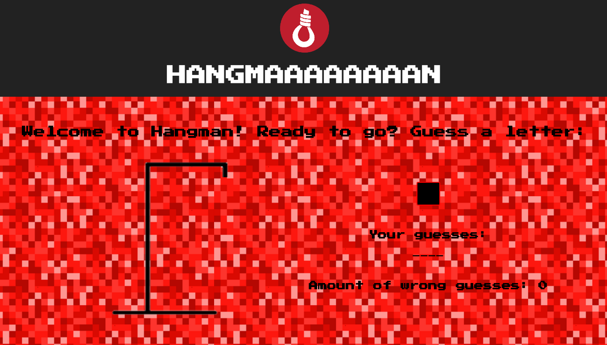

## Hangman game built with React and Redux

Front-end application that has the following functionalities:

- guess random Star Wars trivia word that is taken from an array
- show amount of wrong guesses
- show previous guesses
- guessing the same letter twice won't be counted as another wrong guess
- update the hangman drawing with every wrong guess
- game is lost after 6 wrong guesses
- winning or loosing the game shows the solution

